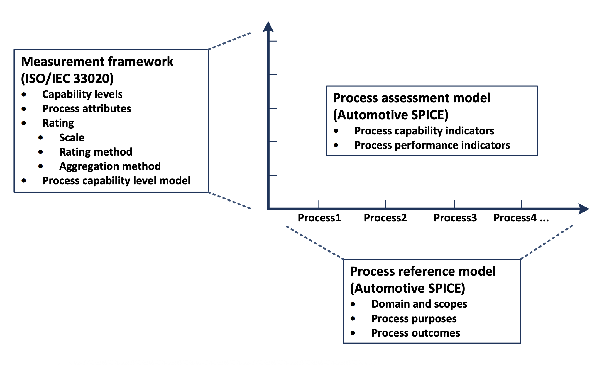
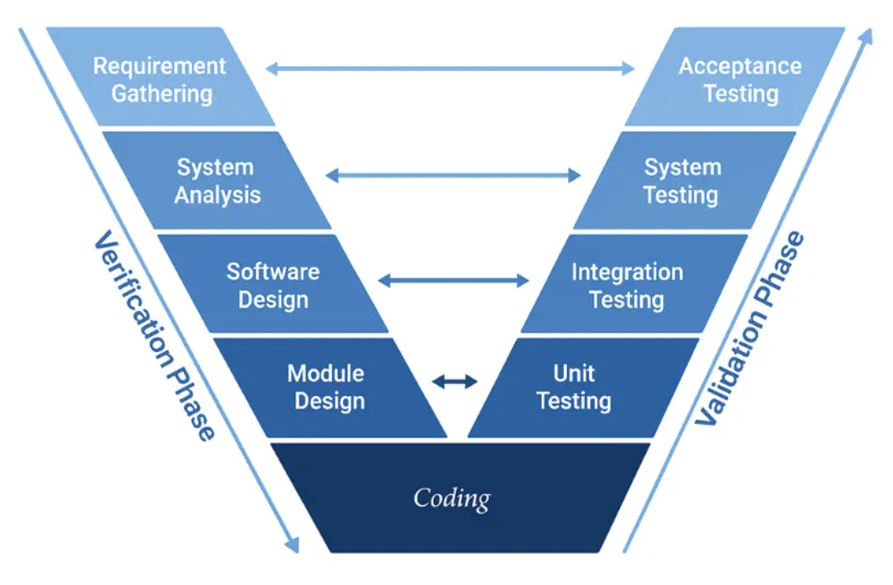
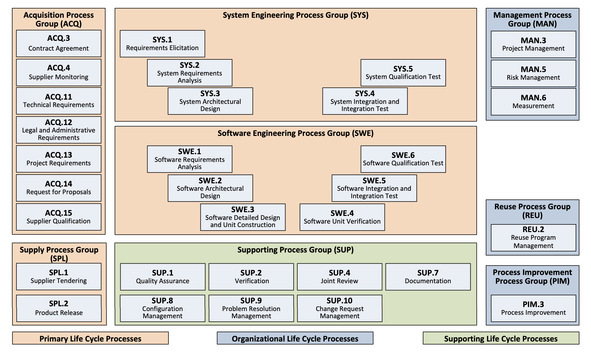
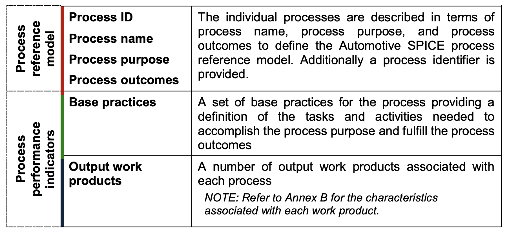
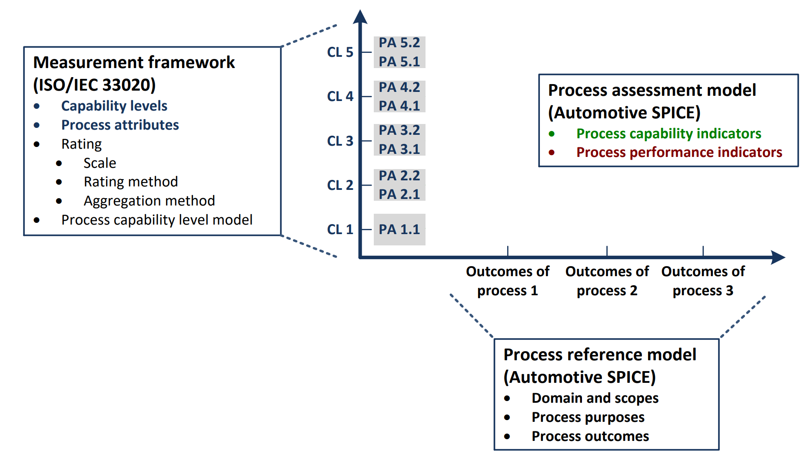
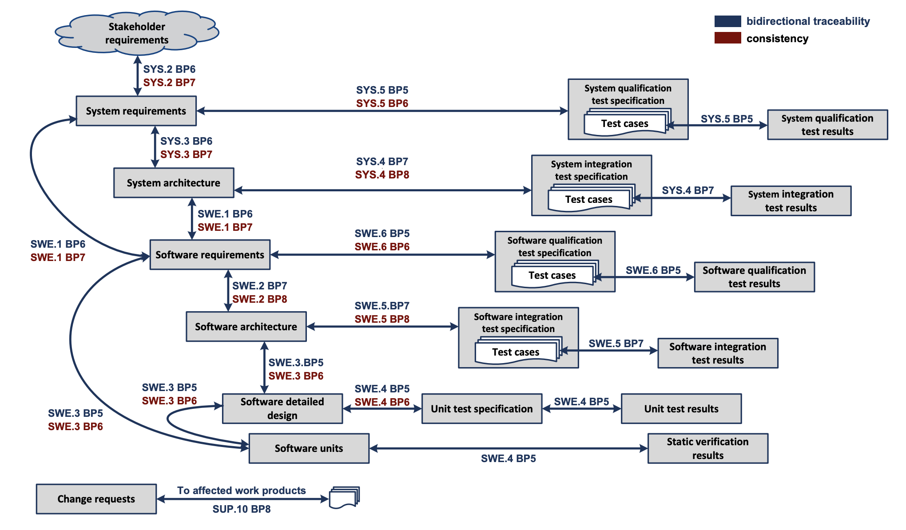

- [A Study of ASPICE](#a-study-of-aspice)
- [Common Misunderstandings (Delusions) About ASPICE](#common-misunderstandings-delusions-about-aspice)
- [Truth of ASPICE](#truth-of-aspice)
  - [Process Assessment and SPICE](#process-assessment-and-spice)
  - [Automotive SPICE](#automotive-spice)
  - [A-SPICE Process Reference Model](#a-spice-process-reference-model)
    - [V-Model Mindset](#v-model-mindset)
    - [Process Reference Model 3.0](#process-reference-model-30)
    - [Acquisition Process Group (ACQ)](#acquisition-process-group-acq)
      - [ACQ.3 Contract Agreement](#acq3-contract-agreement)
      - [ACQ.4 Supplier Monitoring](#acq4-supplier-monitoring)
      - [ACQ.11 Technical Requirements](#acq11-technical-requirements)
      - [ACQ.12 Legal and Administrative Requirements](#acq12-legal-and-administrative-requirements)
      - [ACQ.13 Project Requirements](#acq13-project-requirements)
      - [ACQ.14 Request for Proposals](#acq14-request-for-proposals)
      - [ACQ.15 Supplier Qualification](#acq15-supplier-qualification)
    - [System Engineering Process Group (SYS)](#system-engineering-process-group-sys)
      - [SYS.1 Requirements Elicitation](#sys1-requirements-elicitation)
      - [SYS.2 System Requirements Analysis](#sys2-system-requirements-analysis)
      - [SYS.3 System Architectural Design](#sys3-system-architectural-design)
      - [SYS.4 System Integration and Integration Test](#sys4-system-integration-and-integration-test)
      - [SYS.5 System Qualification Test](#sys5-system-qualification-test)
    - [Software Engineering Process Group (SWE)](#software-engineering-process-group-swe)
      - [SWE.1 Software Requirements Analysis](#swe1-software-requirements-analysis)
      - [SWE.2 Software Architectural Design](#swe2-software-architectural-design)
      - [SWE.3 Software Detailed Design and Unit Construction](#swe3-software-detailed-design-and-unit-construction)
      - [SWE.4 Software Unit Verification](#swe4-software-unit-verification)
      - [SWE.5 Software Integration and Integration Test](#swe5-software-integration-and-integration-test)
      - [SWE.6 Software Qualification Test](#swe6-software-qualification-test)
    - [Supporting Process Group (SUP)](#supporting-process-group-sup)
      - [SUP.1 Quality Assurance](#sup1-quality-assurance)
      - [SUP.2 Verification](#sup2-verification)
      - [SUP.4 Joint Review](#sup4-joint-review)
      - [SUP.7 Documentation](#sup7-documentation)
      - [SUP.8 Configuration Management](#sup8-configuration-management)
      - [SUP.9 Problem Resolution Management](#sup9-problem-resolution-management)
      - [SUP.10 Change Request Management](#sup10-change-request-management)
    - [Supply Process Group (SPL)](#supply-process-group-spl)
      - [SPL.1 Supplier Tendering](#spl1-supplier-tendering)
      - [SPL.2 Product Release](#spl2-product-release)
    - [Management Process Group (MAN)](#management-process-group-man)
      - [MAN.3 Project Management](#man3-project-management)
      - [MAN.5 Risk Management](#man5-risk-management)
      - [MAN.6 Measurement](#man6-measurement)
    - [Process Improvement Process Group (PIM)](#process-improvement-process-group-pim)
      - [PIM.3 Process Improvement](#pim3-process-improvement)
    - [Reuse Process Group (REU)](#reuse-process-group-reu)
      - [REU.2 Reuse Program Management](#reu2-reuse-program-management)
  - [A-SPICE Process Assessment Model](#a-spice-process-assessment-model)
    - [Process Capability Levels and Process Attributes](#process-capability-levels-and-process-attributes)
    - [Process Attribute Rating Scale](#process-attribute-rating-scale)
    - [Process Capability Level Model](#process-capability-level-model)
  - [Traceability and Consistency](#traceability-and-consistency)
  - [A-SPICE Good Practices](#a-spice-good-practices)
    - [MAN.3 Project Management](#man3-project-management-1)
- [Summary](#summary)
- [Q \& A](#q--a)
- [References](#references)

# A Study of ASPICE

# Common Misunderstandings (Delusions) About ASPICE

Many people misunderstand what `ASPICE` really is, especially when they first encounter it in automotive software projects.

**ASPICE is coding standard**:

`ASPICE` talks a lot about software development, audits often look at code-related artifacts, and developers are heavily involved in `ASPICE` projects... But `ASPICE` does not tell us how to write code, `ASPICE` checks how the code artifacts fit the development process. Coding standards like `AUTOSAR`, `MISRA-C`... are used along with `ASPICE` but they are not `ASPICE` itself.

**ASPICE tells us how to write documents or design**:

Because audits review many documents (requirements, architecture, design, test specs) and Requirement Engineering team often prepare “ASPICE-style” templates, people think `ASPICE` defines how to write documents or how to design software. But `ASPICE` does not prescribe a specific document format, template, diagram type, or design method. It does not say “use this architecture pattern”, “use UML”, “write SRS in this structure”, or “your design must look like this”.

**ASPICE is a tool to process requirements**:

But `ASPICE` does not require any specific tool. We can use professional tools, Word, Excel, plain text editor... `ASPICE` checks the testability of requirements, traceability of code and design, ...

**ASPICE is a testing (verification) framework**:

Many `ASPICE` processes include “Verification” and “Test”, test cases and reports are heavily reviewed... But `ASPICE` does not define how to write unit tests, not tell us to use any specific test framework... But `ASPICE` ensures every requirement has a test.

**ASPICE guarantees product quality by itself**:

Higher `ASPICE` level sounds like higher quality, management often sells `ASPICE` as “quality assurance”, and `ASPICE` is often used by big OEMs... but `ASPICE` does not guarantee good products. We follow `ASPICE` to reduce risks, detect problem earlier...

**ASPICE certification means the software is free of bugs**:

“Assessment” sounds like “certification”, customers trust assessed suppliers... But `ASPICE` does not certify software. The higher level of `ASPICE` means the team followed defined processes, and evidence exists for developement steps.

**ASPICE is a one-time activity, not a continuous process**:

Teams rush before audits, documents are created just for assessment... But `ASPICE` processes repeat every sprint, every release, every project.

**After learning the real facts of ASPICE, all these wrong thoughts will become clear.**

# Truth of ASPICE

## Process Assessment and SPICE

Process assessment is a structured evaluation of how well an organization performs its development processes.

To judge a software product, we use tests. Test results tell us if the software meets its requirements and performs well. But judging a development process is different.

When we assess a process, we judge not what was built, but how it was built. Instead of saying “the software works,” a process assessment asks questions like:

- How well can the team build software in a predictable way?
- Do good results happen consistently, or only because of individual effort or luck?
- Can the process be repeated, improved, and scaled to larger, more complex projects?

`SPICE`, which stands for **Software Process Improvement and Capability Determination**, provides a framework for this evaluation.

`SPICE` originated from [ISO/IEC 15504-5:2012 standard](https://www.iso.org/standard/60555.html), which defined how software processes can be assessed in a consistent and measurable way. This standard introduced the concept of **capability levels** and **process attributes**.

Later, this framework evolved into the `ISO/IEC 330xx` family of standards. In particular, [ISO/IEC 33020](https://www.iso.org/standard/54195.html) defines the **measurement framework** used to assess process capability.

## Automotive SPICE

`Automotive SPICE` is a specialization of `SPICE` for the automotive industry because automotive software development is complex, safety-critical, and distributed across long supply chains (OEMs, Tier-1, Tier-2 suppliers).

In 2005, `Automotive SPICE` was published for the first time by the “Automotive Special Interest Group”.

`Automotive SPICE` standard defined its own **Process Reference Model (PRM)** to describe the processes, and **Process Assessment Model (PAM)** based on the lastest version of `ISO/IEC 330xx` series as the measurement framework that indicates the assesment of these processes.

>**Automotive SPICE = Process Reference Model (PRM) + Process Assesment Model (PAM)**



## A-SPICE Process Reference Model

### V-Model Mindset

`V-model` is a type of `SDLC` (Software Development Life Cycle), an evolution of the traditional waterfall approach.

In the waterfall model, development moves step by step from requirements to design, implementation, and finally testing. Testing mainly happens at the end.

The `V-model` keeps the same development steps but adds a corresponding test activity for each development activity. This means test planning starts early, not after coding is finished. Each phase on the left side of the `V-model` has a matching verification or validation activity on the right side.



A key idea of the `V-model` is traceability. Each requirement can be traced to a design element, then to code, and finally to a test that proves the requirement is fulfilled. This traceability helps answer important questions such as: “Where is this requirement implemented?” and “Which test verifies it?” When changes occur or tests fail, traceability makes it much easier to identify what needs to be updated.

### Process Reference Model 3.0

The Process Reference Model reflects the `SPI` in `SPICE`, it is the Software Process Improvement specialized for Automotive.

Processes are grouped by process category and at a second level into process groups according to the type of activity they address. There are `3` process categories:

- Primary life cycle processes
- Organizational life cycle processes
- Supporting life cycle processes



In PRM 3.0, the `V-model` is embedded into the structure of the processes themselves, especially in the System Engineering (`SYS`) and Software Engineering (`SWE`) process groups.

In simple terms:

>PRM 3.0 uses SYS and SWE processes to implement the V-model step by step, with clear development activities on the left side and matching verification activities on the right side.

Each process that the Process Reference Model contains will be described by a common template:



In short, each process will have:
- ID and Name
- Purpose
- Activities (Base Practices - BP)
- Outcomes (Work Products - WP)

The System Engineering (`SYS`) and Software Engineering (`SWE`) process groups are considered the "heart" of the ASPICE Process Reference Model (`PRM`).

### Acquisition Process Group (ACQ)

The Acquisition Process Group is part of the Primary Life Cycle Processes in ASPICE 3. It addresses activities performed by the customer/acquirer organization (heavily focus on documentations like requirements, contracts...) when obtaining products or services from suppliers.

#### ACQ.3 Contract Agreement

**Purpose**: To negotiate and approve a contract/agreement with the supplier that clearly defines expectations, responsibilities, and terms for both parties.

**Activities**:

`ACQ.3.BP1`: Negotiate all relevant aspects of the contract with the supplier (requirements, acceptance criteria, payment terms, process requirements)

`ACQ.3.BP2`: Specify rights and duties of both parties unambiguously in the contract

`ACQ.3.BP3`: Review and include mechanisms for monitoring supplier capability and performance

`ACQ.3.BP4`: Review and include mechanisms for mitigating identified risks

`ACQ.3.BP5`: Obtain approval of the contract from relevant stakeholders

`ACQ.3.BP6`: Award the contract to the successful supplier

`ACQ.3.BP7`: Communicate the selection results to all proposers/tenderers

**Outcomes**:

`ACQ.3.WP1`: A negotiated, reviewed, approved and awarded contract/agreement is established with the supplier

`ACQ.3.WP2`: The contract clearly and unambiguously specifies expectations, responsibilities, deliverables and liabilities for both supplier and acquirer

`ACQ.3.WP3`: Mechanisms for monitoring supplier capability/performance and risk mitigation are considered and included in the contract

`ACQ.3.WP4`: All proposers/tenderers are notified of the selection result

#### ACQ.4 Supplier Monitoring

**Purpose**: To track and assess the performance of the supplier against agreed requirements.

**Activities**:

`ACQ.4.BP1`: Establish and maintain agreements on joint processes, interfaces, information exchange, and regular communications between customer and supplier

`ACQ.4.BP2`: Exchange all agreed information using defined joint interfaces

`ACQ.4.BP3`: Review technical development with the supplier regularly, covering technical aspects, problems, risks and tracking open items

`ACQ.4.BP4`: Review supplier progress regularly regarding schedule, quality and cost

`ACQ.4.BP5`: Take corrective actions when agreed objectives are not achieved and negotiate changes to agreements as needed

**Outcomes**:

`ACQ.4.WP1`: Joint activities agreed between customer and supplier are performed as needed

`ACQ.4.WP2`: All agreed information is communicated regularly between supplier and customer

`ACQ.4.WP3`: Supplier performance is monitored against the agreements

`ACQ.4.WP4`: Changes to the agreement are negotiated between customer and supplier and documented when needed

#### ACQ.11 Technical Requirements

**Purpose**: To establish the technical requirements of the acquisition by eliciting functional and non-functional requirements that consider the deployment life cycle of the products and establish a technical requirement baseline.

**Activities**:

`ACQ.11.BP1`: Elicit needs from all relevant user groups

`ACQ.11.BP2`: Define and develop technical requirements and potential solutions, including environment, safety, security, performance and supportability requirements

`ACQ.11.BP3`: Gather and define current and evolving acquisition needs

`ACQ.11.BP4`: Ensure consistency between technical requirements and acquisition needs

`ACQ.11.BP5`: Identify all affected groups and communicate technical requirements and potential solutions to them

`ACQ.11.BP6`: Communicate technical requirements and potential solutions to all affected groups (may use business terms, simulation, or prototyping for better understanding)

`ACQ.11.BP7`: Establish a mechanism to incorporate changed or new requirements into the baseline

`ACQ.11.BP8`: Define a mechanism for identifying and managing the impact of changing technology on technical requirements

`ACQ.11.BP9`: Identify applicable constraints and standards

`ACQ.11.BP10`: Ensure technical requirements include compliance with relevant standards (environment, safety, security)

**Outcomes**:

`ACQ.11.WP1`: Technical requirements including environment evaluation, safety and security requirements are defined and developed to match needs and expectations

`ACQ.11.WP2`: Current and evolving acquisition needs are gathered and defined

`ACQ.11.WP3`: Requirements and potential solutions are communicated to all affected groups

`ACQ.11.WP4`: A mechanism is established to incorporate changed or new requirements into the baseline

`ACQ.11.WP5`: A mechanism for identifying and managing the impact of changing technology to technical requirements is defined

`ACQ.11.WP6`: Requirements include compliance with relevant standards including environment, safety and security standards

#### ACQ.12 Legal and Administrative Requirements

**Purpose**: To define the awarding aspects including expectations, liabilities, legal and other issues that comply with national and international laws of contract.

**Activities**:

`ACQ.12.BP1`: Identify relevant national, international and regulatory laws, guidance and policies

`ACQ.12.BP2`: Consider identified laws, guidance and policies when defining a contractual approach

`ACQ.12.BP3`: Agree on contractual terms and conditions covering responsibilities, payments, maintenance, upgrades and support agreements

`ACQ.12.BP4`: Ensure usage of agreed terms and conditions when describing how supplier will meet needs and expectations

`ACQ.12.BP5`: Establish acceptance criteria for deliverables

`ACQ.12.BP6`: Establish escalation mechanisms for handling breaches to contract fulfillment

`ACQ.12.BP7`: Establish the acquirer's rights regarding Intellectual Property Rights (assume, modify or evaluate)

`ACQ.12.BP8`: Provide for warranties and service level agreements where applicable

`ACQ.12.BP9`: Define provision for suppliers to deliver other requirements such as quality plans or escrow arrangements

`ACQ.12.BP10`: Establish recognized criteria for proprietary, regulatory and product liability issues

**Outcomes**:

`ACQ.12.WP1`: A contractual approach compliant with relevant national, international and regulatory laws, guidance and policies is defined

`ACQ.12.WP2`: Agreement terms and conditions are defined to describe how the supplier will meet the needs and expectations

`ACQ.12.WP3`: Acceptance criteria and mechanisms for handling contract breaches are established

`ACQ.12.WP4`: The acquirer's rights to assume, modify or evaluate Intellectual Property Rights are established

`ACQ.12.WP5`: Warranties and service level agreements are provided where applicable

`ACQ.12.WP6`: Provision for suppliers to deliver other requirements (quality plan, escrow arrangements) is defined

`ACQ.12.WP7`: Recognized criteria for proprietary, regulatory and other product liability issues are established

#### ACQ.13 Project Requirements

**Purpose**: To specify the requirements to ensure the acquisition project is performed with adequate planning, staffing, directing, organizing and control over project tasks and activities.

**Activities**:

`ACQ.13.BP1`: Identify relevant parties/stakeholders and experts for financial, technical, contract and project issues

`ACQ.13.BP2`: Communicate with relevant parties regarding specification of financial, technical, contract and project requirements

`ACQ.13.BP3`: Define requirements for organizational aspects of the project (roles, responsibilities at different levels)

`ACQ.13.BP4`: Define requirements for management, controlling and reporting aspects of the project

`ACQ.13.BP5`: Identify required competencies (legal, contractual, technical, project) for key resources

`ACQ.13.BP6`: Define responsibilities and goals of team members

`ACQ.13.BP7`: Identify information needs of relevant parties and define how information will be exchanged

`ACQ.13.BP8`: Define how project information will be exchanged between parties, considering the methods (electronic tools, face-to-face meetings, etc.) and frequency of information exchange.

`ACQ.13.BP9`: Establish criteria for completion and acceptance of interim work products

`ACQ.13.BP10`: Establish requirements for release of payments

`ACQ.13.BP11`: Identify risks associated with project life cycle and suppliers

`ACQ.13.BP12`: Communicate all identified risks to relevant parties

`ACQ.13.BP13`: Define requirements for ownership of interactions and relationships with suppliers

`ACQ.13.BP14`: Define rights for use and distribution of the product by customer and supplier

`ACQ.13.BP15`: Establish support and maintenance requirements

**Outcomes**:

`ACQ.13.WP1`: Consistency between financial, technical, contractual and project requirements is established

`ACQ.13.WP2`: Requirements for organizational, management, controlling and reporting aspects of the project are defined

`ACQ.13.WP3`: Requirements for adequate staffing by a competent team with clear responsibilities and goals are defined

`ACQ.13.WP4`: Needs for exchanging information between all affected parties are established

`ACQ.13.WP5`: Requirements for completion and acceptance of interim work products and release of payments are established

`ACQ.13.WP6`: Potential risks are identified and communicated

`ACQ.13.WP7`: Requirements for ownership of interactions and relationships with suppliers are defined

`ACQ.13.WP8`: Rights for use and distribution of the product by customer and supplier are defined

`ACQ.13.WP9`: Support and maintenance requirements are established

#### ACQ.14 Request for Proposals

**Purpose**: To prepare and issue the necessary acquisition requirements including contract, project, finance and technical requirements to be provided for use in the Call For Proposals (CFP) / Invitation To Tender (ITT).

**Activities**:

`ACQ.14.BP1`: Define rules for proposal/tender invitation and evaluation that comply with acquisition policy and strategy

`ACQ.14.BP2`: Assemble the baseline technical and non-technical requirements to accompany the CFP/ITT

`ACQ.14.BP3`: Establish the agreement (contractual) terms of reference and conditions for CFP/ITT

`ACQ.14.BP4`: Define the financial terms of reference for costs and payments for CFP/ITT

`ACQ.14.BP5`: Define the project terms of reference for CFP/ITT

`ACQ.14.BP6`: Define the technical terms of reference for CFP/ITT

`ACQ.14.BP7`: Identify relevant international and regulatory laws, requirements and policies for CFP preparation

`ACQ.14.BP8`: Prepare and issue a CFP/ITT in accordance with acquisition policies and compliant with relevant laws and regulations

**Outcomes**:

`ACQ.14.WP1`: Rules are defined for proposal/tender invitation and evaluation which comply with acquisition policy and strategy

`ACQ.14.WP2`: The baseline technical and non-technical requirements are assembled to accompany the CFP/ITT

`ACQ.14.WP3`: The agreement (contractual) terms of reference and conditions for CFP/ITT are established

`ACQ.14.WP4`: The financial terms of reference for costs and payments for CFP/ITT are defined

`ACQ.14.WP5`: The project terms of reference for CFP/ITT are defined

`ACQ.14.WP6`: The technical terms of reference for CFP/ITT are defined

`ACQ.14.WP7`: A CFP/ITT is prepared and issued in accordance with acquisition policies and compliant with relevant national, international and regulatory laws, requirements and policies

#### ACQ.15 Supplier Qualification

**Purpose**: To evaluate and determine if potential suppliers have the required qualification for entering the proposal/tender evaluation process, including evaluation of technical background, quality system, servicing and user support capabilities.

**Activities**:

`ACQ.15.BP1`: Establish criteria for qualifying suppliers (technical background, quality system, servicing, user support capabilities)

`ACQ.15.BP2`: Perform supplier capability determination as necessary

`ACQ.15.BP3`: Short-list the suppliers with required qualification for tender solution evaluation

`ACQ.15.BP4`: Identify and evaluate any shortfalls in supplier capabilities

`ACQ.15.BP5`: Evaluate and perform corrective actions required by the acquirer

**Outcomes**:

`ACQ.15.WP1`: Criteria are established for qualifying suppliers

`ACQ.15.WP2`: Supplier capability determination is performed as necessary

`ACQ.15.WP3`: Suppliers which possess required qualification are short-listed for tender solution evaluation

`ACQ.15.WP4`: Any shortfalls in capability are identified and evaluated

`ACQ.15.WP5`: Any corrective action required by the acquirer is evaluated and performed

### System Engineering Process Group (SYS)

The System Engineering Process Group (SYS) is one of the core process groups in `ASPICE` that deals with building complete systems, not just software.

What is a "system" in automotive context?

A system is much bigger than just code. It includes:

- Software running on processors
- Hardware components (chips, boards, sensors)
- Electronic Control Units (ECUs)
- Mechanical parts (housing, connectors, wiring)
- Communication networks (CAN, Ethernet)
- Power supply and actuators

On the left side of the `V-model`, SYS defines and breaks down the system. On the right side, `SYS` brings the parts together and checks the full system.

#### SYS.1 Requirements Elicitation

**Purpose**: To gather, process, and track evolving stakeholder needs and requirements throughout the product lifecycle and establish a requirements baseline that serves as the basis for defining needed work.

**Activities**:

`SYS.1.BP1`: Obtain stakeholder requirements and requests through direct communication, customer input, business proposals, and documentation review

`SYS.1.BP2`: Ensure both supplier and customer understand each requirement in the same way

`SYS.1.BP3`: Get explicit agreement from all relevant parties to work on the requirements

`SYS.1.BP4`: Establish a formal stakeholder requirements baseline for project use and monitoring

`SYS.1.BP5`: Manage all changes to stakeholder requirements against the baseline and assess impacts and risks

`SYS.1.BP6`: Set up a communication mechanism so customers can track the status of their requirements and requests

**Outcomes**:

`SYS.1.WP1`: Ongoing communication with stakeholders is established

`SYS.1.WP2`: Agreed stakeholder requirements are defined and baselined

`SYS.1.WP3`: A change mechanism exists to evaluate and incorporate requirement changes based on evolving needs

`SYS.1.WP4`: A mechanism for continuous monitoring of stakeholder needs is in place

`SYS.1.WP5`: Customers can easily check the status and disposition of their requests

`SYS.1.WP6`: Changes from evolving technology and stakeholder needs are identified, risks assessed, and impacts managed

#### SYS.2 System Requirements Analysis

**Purpose**: To transform stakeholder requirements into a detailed set of system requirements that will guide the design of the system.

**Activities**:

`SYS.2.BP1`: Specify system requirements by identifying required functions and capabilities from stakeholder requirements

`SYS.2.BP2`: Structure system requirements by grouping, sorting, categorizing, and prioritizing them according to project needs

`SYS.2.BP3`: Analyze system requirements for correctness, technical feasibility, verifiability, and to identify risks and interdependencies

`SYS.2.BP4`: Analyze the impact on the operating environment by identifying interfaces and their implications

`SYS.2.BP5`: Develop verification criteria for each system requirement that define how the requirement will be verified

`SYS.2.BP6`: Establish bidirectional traceability between stakeholder requirements and system requirements

`SYS.2.BP7`: Ensure consistency between stakeholder requirements and system requirements

`SYS.2.BP8`: Communicate the agreed system requirements and any updates to all relevant parties

**Outcomes**:

`SYS.2.WP1`: A defined set of system requirements is established

`SYS.2.WP2`: System requirements are categorized and analyzed for correctness and verifiability

`SYS.2.WP3`: The impact of system requirements on the operating environment is analyzed

`SYS.2.WP4`: Prioritization for implementing the system requirements is defined

`SYS.2.WP5`: System requirements are updated as needed

`SYS.2.WP6`: Consistency and bidirectional traceability are established between stakeholder requirements and system requirements

`SYS.2.WP7`: System requirements are evaluated for cost, schedule, and technical impact

`SYS.2.WP8`: System requirements are agreed upon and communicated to all affected parties

#### SYS.3 System Architectural Design

**Purpose**: To establish a system architectural design, allocate system requirements to system elements, and evaluate the architecture against defined criteria.

**Activities**:

`SYS.3.BP1`: Develop and document the system architectural design that specifies the elements of the system based on functional and non-functional requirements

`SYS.3.BP2`: Allocate system requirements to the elements of the system architectural design

`SYS.3.BP3`: Identify, develop, and document the interfaces of each system element

`SYS.3.BP4`: Evaluate and document the dynamic behavior of interaction between system elements

`SYS.3.BP5`: Define evaluation criteria and evaluate alternative system architectures, recording the rationale for the chosen architecture

`SYS.3.BP6`: Establish bidirectional traceability between system requirements and elements of the system architectural design

`SYS.3.BP7`: Ensure consistency between system requirements and the system architectural design

`SYS.3.BP8`: Communicate the agreed system architectural design and any updates to all relevant parties

**Outcomes**:

`SYS.3.WP1`: A system architectural design is defined that identifies the elements of the system

`SYS.3.WP2`: System requirements are allocated to the elements of the system

`SYS.3.WP3`: Interfaces of each system element are defined

`SYS.3.WP4`: Dynamic behavior of the system elements is defined

`SYS.3.WP5`: Consistency and bidirectional traceability are established between system requirements and system architectural design

`SYS.3.WP6`: System architectural design is agreed upon and communicated to all affected parties

#### SYS.4 System Integration and Integration Test

**Purpose**: To integrate system items to produce a complete integrated system consistent with the system architectural design and test system items to provide evidence for compliance with the design, including interfaces between system items.

**Activities**:

`SYS.4.BP1`: Develop a system integration strategy that defines the sequence for integrating system items consistent with the project plan and architectural design

`SYS.4.BP2`: Develop a system integration test strategy including regression test strategy for re-testing if system items change

`SYS.4.BP3`: Develop test specification for system integration test that includes test cases suitable to prove compliance with the architectural design

`SYS.4.BP4`: Integrate the system items step by step to produce an integrated system according to the integration strategy

`SYS.4.BP5`: Select test cases from the system integration test specification with sufficient coverage according to the test strategy and release plan

`SYS.4.BP6`: Perform system integration test using selected test cases and record test results and logs

`SYS.4.BP7`: Establish bidirectional traceability between architectural design elements and test cases, and between test cases and test results

`SYS.4.BP8`: Ensure consistency between system architectural design elements and test cases

`SYS.4.BP9`: Summarize the system integration test results and communicate them to all affected parties

**Outcomes**:

`SYS.4.WP1`: A system integration strategy consistent with project plan, release plan, and system architectural design is developed

`SYS.4.WP2`: A system integration test strategy including regression test strategy is developed

`SYS.4.WP3`: A specification for system integration test is developed that provides evidence for compliance with the architectural design

`SYS.4.WP4`: System items are integrated up to a complete integrated system according to the integration strategy

`SYS.4.WP5`: Test cases are selected according to the system integration test strategy and release plan

`SYS.4.WP6`: System item interactions are tested using selected test cases and results are recorded

`SYS.4.WP7`: Consistency and bidirectional traceability are established between architectural design elements, test cases, and test results

`SYS.4.WP8`: Results of system integration test are summarized and communicated to all affected parties

#### SYS.5 System Qualification Test

**Purpose**: To ensure that the integrated system is tested to provide evidence for compliance with the system requirements and that the system is ready for delivery.

**Activities**:

`SYS.5.BP1`: Develop a system qualification test strategy including regression test strategy consistent with the project plan and release plan

`SYS.5.BP2`: Develop test specification for system qualification test including test cases based on verification criteria that prove compliance with system requirements

`SYS.5.BP3`: Select test cases from the system qualification test specification with sufficient coverage according to the test strategy and release plan

`SYS.5.BP4`: Test the integrated system using the selected test cases and record system qualification test results and logs

`SYS.5.BP5`: Establish bidirectional traceability between system requirements and test cases, and between test cases and test results

`SYS.5.BP6`: Ensure consistency between system requirements and test cases in the system qualification test specification

`SYS.5.BP7`: Summarize the system qualification test results and communicate them to all affected parties

**Outcomes**:

`SYS.5.WP1`: A system qualification test strategy including regression test strategy consistent with project plan and release plan is developed

`SYS.5.WP2`: A specification for system qualification test is developed that provides evidence for compliance with system requirements

`SYS.5.WP3`: Test cases are selected according to the system qualification test strategy and release plan

`SYS.5.WP4`: The integrated system is tested using selected test cases and results are recorded

`SYS.5.WP5`: Consistency and bidirectional traceability are established between system requirements, test cases, and test results

`SYS.5.WP6`: Results of system qualification test are summarized and communicated to all affected parties

### Software Engineering Process Group (SWE)

The Software Engineering Process Group (SWE) is the "software-only" part of ASPICE. While the System Engineering Group (SYS) deals with the complete system—including hardware, electronics, wiring, and sensors—SWE focuses purely on the software side of things.

The Software Engineering Process Group (`SWE`) applies the same `V-model` logic, but only for software. On the left side of the `V-model`, `SWE` defines software requirements and design. On the right side, `SWE` verifies units, integrates components, and checks the software against its requirements.

#### SWE.1 Software Requirements Analysis

**Purpose**: To transform the software-related parts of system requirements into a detailed set of software requirements.

**Activities**:

`SWE.1.BP1`: Specify software requirements by identifying required software functions and capabilities from system requirements and system architecture

`SWE.1.BP2`: Structure software requirements by grouping, sorting, categorizing, and prioritizing them according to project needs

`SWE.1.BP3`: Analyze software requirements for correctness, technical feasibility, verifiability, and to identify risks and interdependencies

`SWE.1.BP4`: Analyze the impact on the operating environment by examining how software requirements affect system interfaces and the environment

`SWE.1.BP5`: Develop verification criteria for each software requirement that define how the requirement will be verified

`SWE.1.BP6`: Establish bidirectional traceability between system requirements and software requirements, and between system architecture and software requirements

`SWE.1.BP7`: Ensure consistency between system requirements and software requirements, and between system architecture and software requirements

`SWE.1.BP8`: Communicate the agreed software requirements and any updates to all relevant parties

**Outcomes**:

`SWE.1.WP1`: Software requirements to be allocated to software elements of the system and their interfaces are defined

`SWE.1.WP2`: Software requirements are categorized and analyzed for correctness and verifiability

`SWE.1.WP3`: The impact of software requirements on the operating environment is analyzed

`SWE.1.WP4`: Prioritization for implementing the software requirements is defined

`SWE.1.WP5`: Software requirements are updated as needed

`SWE.1.WP6`: Consistency and bidirectional traceability are established between system requirements and software requirements, and between system architectural design and software requirements

`SWE.1.WP7`: Software requirements are evaluated for cost, schedule, and technical impact

`SWE.1.WP8`: Software requirements are agreed upon and communicated to all affected parties

#### SWE.2 Software Architectural Design

**Purpose**: To establish a software architectural design, allocate software requirements to software elements, and evaluate the architecture against defined criteria.

**Activities**:

`SWE.2.BP1`: Develop and document the software architectural design that specifies the elements of the software based on functional and non-functional requirements

`SWE.2.BP2`: Allocate software requirements to the elements of the software architectural design

`SWE.2.BP3`: Identify, develop, and document the interfaces of each software element

`SWE.2.BP4`: Evaluate and document the timing and dynamic interaction of software elements to meet required dynamic behavior

`SWE.2.BP5`: Determine and document resource consumption objectives for relevant software elements (memory, CPU load, etc.)

`SWE.2.BP6`: Define evaluation criteria and evaluate alternative software architectures, recording the rationale for the chosen architecture

`SWE.2.BP7`: Establish bidirectional traceability between software requirements and elements of the software architectural design

`SWE.2.BP8`: Ensure consistency between software requirements and the software architectural design

`SWE.2.BP9`: Communicate the agreed software architectural design and any updates to all relevant parties

**Outcomes**:

`SWE.2.WP1`: A software architectural design is defined that identifies the elements of the software

`SWE.2.WP2`: Software requirements are allocated to the elements of the software

`SWE.2.WP3`: Interfaces of each software element are defined

`SWE.2.WP4`: Dynamic behavior and resource consumption objectives of the software elements are defined

`SWE.2.WP5`: Consistency and bidirectional traceability are established between software requirements and software architectural design

`SWE.2.WP6`: Software architectural design is agreed upon and communicated to all affected parties

#### SWE.3 Software Detailed Design and Unit Construction

**Purpose**: To provide an evaluated detailed design for the software components and to specify and produce the software units.

**Activities**:

`SWE.3.BP1`: Develop a detailed design for each software component that specifies all software units with respect to functional and non-functional requirements

`SWE.3.BP2`: Identify, specify, and document the interfaces of each software unit

`SWE.3.BP3`: Evaluate and document the dynamic behavior of and interaction between relevant software units

`SWE.3.BP4`: Evaluate the software detailed design in terms of interoperability, interaction, criticality, technical complexity, risks, and testability

`SWE.3.BP5`: Establish bidirectional traceability between software requirements and software units, between software architectural design and software detailed design, and between software detailed design and software units

`SWE.3.BP6`: Ensure consistency between software requirements and software units, and between software architectural design, software detailed design, and software units

`SWE.3.BP7`: Communicate the agreed software detailed design and any updates to all relevant parties

`SWE.3.BP8`: Develop and document the executable representations of each software unit according to the software detailed design

**Outcomes**:

`SWE.3.WP1`: A detailed design is developed that describes software units

`SWE.3.WP2`: Interfaces of each software unit are defined

`SWE.3.WP3`: Dynamic behavior of the software units is defined

`SWE.3.WP4`: Consistency and bidirectional traceability are established between software requirements and software units, between software architectural design and software detailed design, and between software detailed design and software units

`SWE.3.WP5`: Software detailed design and the relationship to the software architectural design is agreed upon and communicated to all affected parties

`SWE.3.WP6`: Software units defined by the software detailed design are produced

#### SWE.4 Software Unit Verification

**Purpose**: To verify software units to provide evidence for compliance with the software detailed design and with the non-functional software requirements.

**Activities**:

`SWE.4.BP1`: Develop a software unit verification strategy including regression strategy for re-verification if a software unit changes

`SWE.4.BP2`: Develop criteria for unit verification that prove compliance with the software detailed design and non-functional requirements (test cases, test data, static verification, coverage goals, coding standards)

`SWE.4.BP3`: Perform static verification of software units for correctness using defined criteria (static analysis, code reviews, checks against coding standards)

`SWE.4.BP4`: Test software units using the unit test specification according to the verification strategy and record test results and logs

`SWE.4.BP5`: Establish bidirectional traceability between software units and static verification results, between software detailed design and unit test specification, and between unit test specification and unit test results

`SWE.4.BP6`: Ensure consistency between the software detailed design and the unit test specification

`SWE.4.BP7`: Summarize the unit test results and static verification results and communicate them to all affected parties

**Outcomes**:

`SWE.4.WP1`: A software unit verification strategy including regression strategy is developed

`SWE.4.WP2`: Criteria for software unit verification are developed that provide evidence for compliance with software detailed design and non-functional requirements

`SWE.4.WP3`: Software units are verified according to the verification strategy and defined criteria, and results are recorded

`SWE.4.WP4`: Consistency and bidirectional traceability are established between software units, criteria for verification, and verification results

`SWE.4.WP5`: Results of unit verification are summarized and communicated to all affected parties

#### SWE.5 Software Integration and Integration Test

**Purpose**: To integrate software units into larger software items up to a complete integrated software consistent with the software architectural design and test them to provide evidence for compliance with the design, including interfaces between software units and software items.

**Activities**:

`SWE.5.BP1`: Develop a software integration strategy that defines the sequence for integrating software items consistent with the project plan and architectural design

`SWE.5.BP2`: Develop a software integration test strategy including regression test strategy for re-testing if a software item changes

`SWE.5.BP3`: Develop test specification for software integration test that includes test cases suitable to prove compliance with the architectural design

`SWE.5.BP4`: Integrate software units to software items and software items to integrated software according to the integration strategy

`SWE.5.BP5`: Select test cases from the software integration test specification with sufficient coverage according to the test strategy and release plan

`SWE.5.BP6`: Perform software integration test using selected test cases and record integration test results and logs

`SWE.5.BP7`: Establish bidirectional traceability between software architectural design elements and test cases, and between test cases and test results

`SWE.5.BP8`: Ensure consistency between software architectural design elements and test cases

`SWE.5.BP9`: Summarize the software integration test results and communicate them to all affected parties

**Outcomes**:

`SWE.5.WP1`: A software integration strategy consistent with project plan, release plan, and software architectural design is developed

`SWE.5.WP2`: A software integration test strategy including regression test strategy is developed

`SWE.5.WP3`: A specification for software integration test is developed that provides evidence for compliance with the architectural design

`SWE.5.WP4`: Software units and software items are integrated up to complete integrated software according to the integration strategy

`SWE.5.WP5`: Test cases are selected according to the software integration test strategy and release plan

`SWE.5.WP6`: Integrated software items are tested using selected test cases and results are recorded

`SWE.5.WP7`: Consistency and bidirectional traceability are established between software architectural design elements, test cases, and test results

`SWE.5.WP8`: Results of software integration test are summarized and communicated to all affected parties

#### SWE.6 Software Qualification Test

**Purpose**: To ensure that the integrated software is tested to provide evidence for compliance with the software requirements.

**Activities**:

`SWE.6.BP1`: Develop a software qualification test strategy including regression test strategy consistent with the project plan and release plan

`SWE.6.BP2`: Develop test specification for software qualification test including test cases based on verification criteria that prove compliance with software requirements

`SWE.6.BP3`: Select test cases from the software test specification with sufficient coverage according to the test strategy and release plan

`SWE.6.BP4`: Test the integrated software using the selected test cases and record software test results and logs

`SWE.6.BP5`: Establish bidirectional traceability between software requirements and test cases, and between test cases and test results

`SWE.6.BP6`: Ensure consistency between software requirements and test cases in the software qualification test specification

`SWE.6.BP7`: Summarize the software qualification test results and communicate them to all affected parties

**Outcomes**:

`SWE.6.WP1`: A software qualification test strategy including regression test strategy consistent with project plan and release plan is developed

`SWE.6.WP2`: A specification for software qualification test is developed that provides evidence for compliance with software requirements

`SWE.6.WP3`: Test cases are selected according to the software qualification test strategy and release plan

`SWE.6.WP4`: The integrated software is tested using selected test cases and results are recorded

`SWE.6.WP5`: Consistency and bidirectional traceability are established between software requirements, test cases, and test results

`SWE.6.WP6`: Results of software qualification test are summarized and communicated to all affected parties

### Supporting Process Group (SUP)

#### SUP.1 Quality Assurance

**Purpose**: To provide independent and objective assurance that work products and processes comply with predefined requirements and plans, and that any non-conformances are identified, resolved, and prevented.

**Activities**:

`SUP.1.BP1`: Develop a quality assurance strategy that ensures independent and objective checks of work products and processes without conflicts of interest

`SUP.1.BP2`: Verify that work products meet their defined requirements according to the quality assurance strategy and schedule

`SUP.1.BP3`: Verify that processes meet their defined goals according to the quality assurance strategy and schedule

`SUP.1.BP4`: Regularly report quality assurance activities, performance, deviations, and trends to relevant parties

`SUP.1.BP5`: Track and ensure non-conformances found during quality checks are analyzed, corrected, and prevented

`SUP.1.BP6`: Establish an escalation mechanism to raise unresolved quality issues to appropriate management levels

**Outcomes**:

`SUP.1.WP1`: A quality assurance strategy is developed, implemented, and maintained

`SUP.1.WP2`: Quality assurance is performed independently and objectively without conflicts of interest

`SUP.1.WP3`: Non-conformances in work products, processes, and activities are identified, recorded, communicated, tracked, resolved, and prevented

`SUP.1.WP4`: Conformance of work products, processes, and activities with requirements is verified, documented, and communicated to relevant parties

`SUP.1.WP5`: Authority to escalate non-conformances to management is established

`SUP.1.WP6`: Management ensures that escalated non-conformances are resolved

#### SUP.2 Verification

**Purpose**: To confirm that each work product of a process or project properly reflects the specified requirements.

**Activities**:

`SUP.2.BP1`: Develop and implement a verification strategy that includes verification methods, techniques, tools, degree of independence, and schedule for performing activities

`SUP.2.BP2`: Develop criteria for verification of all required technical work products

`SUP.2.BP3`: Verify identified work products according to the strategy and criteria to confirm they meet their specified requirements and record the results

`SUP.2.BP4`: Track problems identified by verification through problem resolution management process to analyze, resolve, and prevent them

`SUP.2.BP5`: Report verification results to all affected parties

**Outcomes**:

`SUP.2.WP1`: A verification strategy is developed, implemented, and maintained

`SUP.2.WP2`: Criteria for verification of all required work products are identified

`SUP.2.WP3`: Required verification activities are performed

`SUP.2.WP4`: Defects are identified, recorded, and tracked

`SUP.2.WP5`: Results of verification activities are made available to the customer and other involved parties

#### SUP.4 Joint Review

**Purpose**: To maintain a common understanding with stakeholders of progress against agreement objectives and what should be done to help ensure development of a product that satisfies the stakeholders. Joint reviews are held at both project management and technical levels throughout the project life.

**Activities**:

`SUP.4.BP1`: Define review elements by identifying schedule, scope, participants, required resources (personnel, location, facilities), and criteria for problem identification and resolution based on project needs

`SUP.4.BP2`: Establish a mechanism to ensure review results are available to all affected parties, problems are identified and recorded, and action items are tracked

`SUP.4.BP3`: Prepare joint reviews by collecting, planning, preparing, and distributing review material in advance

`SUP.4.BP4`: Conduct joint management and technical reviews as planned and record the review results

`SUP.4.BP5`: Document and distribute review results to all affected parties

`SUP.4.BP6`: Analyze review results, propose actions for resolution, and determine priority for actions

`SUP.4.BP7`: Track actions for resolution of identified problems to closure

`SUP.4.BP8`: Identify and record problems detected during reviews according to the established mechanism

**Outcomes**:

`SUP.4.WP1`: Management and technical reviews are held based on the needs of the project

`SUP.4.WP2`: The status and products of process activities are evaluated through joint review activities between stakeholders

`SUP.4.WP3`: Review results are made known to all affected parties

`SUP.4.WP4`: Action items resulting from reviews are tracked to closure

`SUP.4.WP5`: Problems are identified and recorded

#### SUP.7 Documentation

**Purpose**: To develop and maintain the recorded information produced by a process.

**Activities**:

`SUP.7.BP1`: Develop a documentation management strategy that addresses where, when, and what should be documented during the product or service life cycle

`SUP.7.BP2`: Establish standards for developing, modifying, and maintaining documentation

`SUP.7.BP3`: Specify requirements for documentation including title, date, identifier, version history, author, reviewer, authorizer, outline of contents, purpose, and distribution list

`SUP.7.BP4`: Identify the relevant documentation to be produced for any given development life cycle

`SUP.7.BP5`: Develop documentation at required process points according to established standards and policy, ensuring content and purpose is reviewed and approved

`SUP.7.BP6`: Review documentation before distribution and authorize documentation as appropriate before distribution or release

`SUP.7.BP7`: Distribute documentation according to determined modes via appropriate media to all affected parties, confirming delivery where necessary

`SUP.7.BP8`: Maintain documentation in accordance with the determined documentation strategy

**Outcomes**:

`SUP.7.WP1`: A strategy identifying the documentation to be produced during the life cycle of the product or service is developed

`SUP.7.WP2`: The standards to be applied for the development of the documentation are identified

`SUP.7.WP3`: Documentation to be produced by the process or project is identified

`SUP.7.WP4`: The content and purpose of all documentation is specified, reviewed, and approved

`SUP.7.WP5`: Documentation is developed and made available in accordance with identified standards

`SUP.7.WP6`: Documentation is maintained in accordance with defined criteria

#### SUP.8 Configuration Management

**Purpose**: To establish and maintain the integrity of all work products of a process or project and make them available to affected parties.

**Activities**:

`SUP.8.BP1`: Develop a configuration management strategy including responsibilities, tools, repositories, criteria for configuration items, naming conventions, access rights, criteria for baselines, merge and branch strategy, and revision history approach

`SUP.8.BP2`: Identify and document configuration items according to the configuration management strategy

`SUP.8.BP3`: Establish a configuration management system according to the strategy

`SUP.8.BP4`: Establish branch management according to the strategy for parallel developments that use the same base

`SUP.8.BP5`: Establish mechanisms for control of configuration items and control modifications and releases using these mechanisms

`SUP.8.BP6`: Establish baselines for internal purposes and for external delivery according to the strategy

`SUP.8.BP7`: Record and report status of configuration items to support project management and other relevant processes

`SUP.8.BP8`: Verify that information about configured items and their baselines is complete and ensure consistency of baselines

`SUP.8.BP9`: Ensure integrity and availability of configuration items and baselines through appropriate storage, archiving, and backup of the configuration management systems

**Outcomes**:

`SUP.8.WP1`: A configuration management strategy is developed

`SUP.8.WP2`: All configuration items generated by a process or project are identified, defined, and baselined according to the configuration management strategy

`SUP.8.WP3`: Modifications and releases of the configuration items are controlled

`SUP.8.WP4`: Modifications and releases are made available to affected parties

`SUP.8.WP5`: The status of the configuration items and modifications is recorded and reported

`SUP.8.WP6`: The completeness and consistency of the baselines is ensured

`SUP.8.WP7`: Storage of the configuration items is controlled

#### SUP.9 Problem Resolution Management

**Purpose**: To ensure that problems are identified, analyzed, managed, and controlled to resolution.

**Activities**:

`SUP.9.BP1`: Develop a problem resolution management strategy including problem resolution activities, status model, alert notifications, responsibilities, urgent resolution strategy, and interfaces to affected parties

`SUP.9.BP2`: Identify and record each problem uniquely with description and supporting information to reproduce and diagnose the problem

`SUP.9.BP3`: Record the status of problems according to the status model to facilitate tracking

`SUP.9.BP4`: Diagnose the cause and determine the impact of problems in order to categorize them and determine appropriate actions

`SUP.9.BP5`: Authorize urgent resolution action if a problem requires immediate action according to the strategy

`SUP.9.BP6`: Raise alert notifications if the problem has high impact on other systems or affected parties according to the strategy

`SUP.9.BP7`: Initiate appropriate actions according to the strategy to resolve the problem, including review of those actions or initiating a change request

`SUP.9.BP8`: Track the status of problems to closure including all related change requests, and obtain formal acceptance before closing the problem

`SUP.9.BP9`: Collect and analyze problem resolution management data, identify trends, and initiate project-related actions according to the strategy

**Outcomes**:

`SUP.9.WP1`: A problem resolution management strategy is developed

`SUP.9.WP2`: Problems are recorded, uniquely identified, and classified

`SUP.9.WP3`: Problems are analyzed and assessed to identify an appropriate solution

`SUP.9.WP4`: Problem resolution is initiated

`SUP.9.WP5`: Problems are tracked to closure

`SUP.9.WP6`: The status of problems and their trend are known

#### SUP.10 Change Request Management

**Purpose**: To ensure that change requests are managed, tracked, and implemented in a controlled and systematic way.

**Activities**:

`SUP.10.BP1`: Develop a change request management strategy that defines how changes will be handled, including status model (open, under investigation, approved, implemented, closed), analysis criteria, and responsibilities

`SUP.10.BP2`: Identify and record each change request uniquely with description, initiator, and reason

`SUP.10.BP3`: Record and track the status of each change request according to the status model

`SUP.10.BP4`: Analyze and assess change requests to understand their impact, dependencies to other changes and affected work products, and resource requirements

`SUP.10.BP5`: Prioritize and approve change requests based on analysis results and available resources before implementation (often through Change Control Board)

`SUP.10.BP6`: Review the implementation of change requests before closure to confirm all criteria are met and relevant processes were followed

`SUP.10.BP7`: Track change requests through their entire lifecycle until closure and provide feedback to the initiator

`SUP.10.BP8`: Establish bidirectional traceability between change requests and affected work products, and to problem reports if the change originated from a problem

**Outcomes**:

`SUP.10.WP1`: A change request management strategy is developed and maintained

`SUP.10.WP2`: All change requests are uniquely identified, recorded, and described

`SUP.10.WP3`: Dependencies and relationships between change requests and other work products are identified

`SUP.10.WP4`: Clear criteria for confirming implementation of changes are defined

`SUP.10.WP5`: Change requests are analyzed and resource requirements are estimated

`SUP.10.WP6`: Changes are approved and prioritized based on analysis and resource availability

`SUP.10.WP7`: Approved changes are implemented, tracked, and closed properly

`SUP.10.WP8`: The status of all change requests is visible and known at any time

`SUP.10.WP9`: Bidirectional traceability exists between change requests and affected work products

### Supply Process Group (SPL)

#### SPL.1 Supplier Tendering

**Purpose**: To respond to customer inquiries and requests for proposal, prepare and submit a supplier proposal, and formally agree on the work through a contract or agreement.

**Activities**:

`SPL.1.BP1`: Establish and maintain a communication channel with the customer

`SPL.1.BP2`: Screen customer inquiries to confirm validity and responsibility

`SPL.1.BP3`: Define criteria to decide whether to submit a proposal

`SPL.1.BP4`: Evaluate customer requests for proposal using defined criteria

`SPL.1.BP5`: Decide if preliminary studies or feasibility analysis are needed

`SPL.1.BP6`: Identify and assign suitable and competent staff

`SPL.1.BP7`: Prepare and submit the supplier proposal

`SPL.1.BP8`: Formally confirm the agreement or contract with authorized signatories

**Outcomes**:

`SPL.1.WP1`: A clear communication interface with the customer is in place

`SPL.1.WP2`: Requests for proposal are evaluated consistently

`SPL.1.WP3`: Need for pre-studies is identified when required

`SPL.1.WP4`: Qualified staff are assigned to the proposed work

`SPL.1.WP5`: A supplier proposal is prepared and submitted

`SPL.1.WP6`: A formal agreement or contract is confirmed

#### SPL.2 Product Release

**Purpose**: To control and manage the release of a product so it is correctly built, documented, approved, and delivered to the customer.

**Activities**:

`SPL.2.BP1`: Establish a release plan that identifies the functionality and application parameters to be included in each release

`SPL.2.BP2`: Define all products associated with the release (tools, samples, documentation, etc.)

`SPL.2.BP3`: Establish a release classification and numbering scheme based on the release purpose (major version, feature version, defect repair, alpha/beta, iteration numbers)

`SPL.2.BP4`: Define and maintain a consistent build process and build environment to be used by all parties

`SPL.2.BP5`: Build the release from configured items to ensure integrity (program software onto correct hardware revision if needed)

`SPL.2.BP6`: Identify and communicate the type, service level, and duration of support provided for the release

`SPL.2.BP7`: Determine the delivery media type according to customer needs (intermediate media, direct firmware, electronic server delivery, or mix)

`SPL.2.BP8`: Identify appropriate packaging for the release media including physical or electronic protection (encryption if needed)

`SPL.2.BP9`: Produce, review, approve, and make available all documentation and release notes to support the release

`SPL.2.BP10`: Verify that all release criteria are satisfied before delivery takes place

`SPL.2.BP11`: Ensure consistency between software release number, paper labels, and EPROM labels (if applicable)

`SPL.2.BP12`: Provide a release note detailing key characteristics (introduction, environmental requirements, installation procedures, new features, defect resolutions, known defects and workarounds)

`SPL.2.BP13`: Deliver the product to the intended customer and obtain positive confirmation of receipt (electronically, by hand, post, telephone, or distribution service)

**Outcomes**:

`SPL.2.WP1`: Release content and included functionality are defined

`SPL.2.WP2`: The release is built from controlled and configured items

`SPL.2.WP3`: Release documentation and notes are available

`SPL.2.WP4`: Delivery media and packaging are defined

`SPL.2.WP5`: Release approval is completed before delivery

`SPL.2.WP6`: The product is delivered to the customer

`SPL.2.WP7`: Confirmation of release and receipt is obtained

### Management Process Group (MAN)

The Management Process Group ensures that projects are planned, tracked, and controlled properly. The most critical process is **MAN.3 Project Management**.

#### MAN.3 Project Management

**Purpose**: Identify, establish, and control the activities and resources necessary for a project to produce a product within requirements and constraints.

**Activities**:

`MAN.3.BP1`: Define the scope of work by identifying the project's goals, motivation, and boundaries

`MAN.3.BP2`: Define the project life cycle appropriate to the scope, context, magnitude, and complexity of the project (ensure consistency with customer's development process)

`MAN.3.BP3`: Evaluate the feasibility of achieving project goals in terms of technical feasibility within time, estimates, and available resource constraints

`MAN.3.BP4`: Define, monitor, and adjust project activities and their dependencies according to the project life cycle and estimations (activities cover engineering, management, and supporting processes)

`MAN.3.BP5`: Define, monitor, and adjust project estimates of effort and resources based on project goals, risks, motivation, and boundaries (include people, infrastructure, tools, equipment, hardware, materials)

`MAN.3.BP6`: Identify required skills, knowledge, and experience for the project in line with estimates and ensure selected individuals and teams have or acquire these in time (provide training when needed)

`MAN.3.BP7`: Identify and agree on project interfaces with other sub-projects, organizational units, and stakeholders; monitor agreed commitments

`MAN.3.BP8`: Allocate resources to activities and schedule each project activity; keep the schedule continuously updated throughout the project lifetime

`MAN.3.BP9`: Ensure consistency across estimates, skills, activities, schedules, plans, interfaces, and commitments for the project among all affected parties

`MAN.3.BP10`: Regularly review and report the status of the project and fulfillment of activities against estimated effort and duration to all affected parties; prevent recurrence of identified problems

**Outcomes**:

`MAN.3.WP1`: The scope of work for the project is defined

`MAN.3.WP2`: Feasibility of achieving project goals with available resources and constraints is evaluated

`MAN.3.WP3`: Activities and resources necessary to complete the work are sized and estimated

`MAN.3.WP4`: Interfaces within the project and with other projects and organizational units are identified and monitored

`MAN.3.WP5`: Plans for project execution are developed, implemented, and maintained

`MAN.3.WP6`: Project progress is monitored and reported

`MAN.3.WP7`: Corrective action is taken when project goals are not achieved and recurrence of problems is prevented 

#### MAN.5 Risk Management

**Purpose**: Early identify, analyze, treat, and monitor risks continuously throughout the project.

**Activities**:

`MAN.5.BP1`: Decide the scope of risk management for the project (what risks to track)

`MAN.5.BP2`: Define strategies to find risks, reduce risks, and set acceptable levels

`MAN.5.BP3`: Identify risks at the start and as the project moves forward (technical, timing, cost, resources)

`MAN.5.BP4`: Analyze each risk to understand its probability, impact, and priority

`MAN.5.BP5`: Define actions to treat risks and keep them at acceptable levels

`MAN.5.BP6`: Set up measures (metrics) to track risk status and treatment progress

`MAN.5.BP7`: Take corrective action when risk treatment is not working as expected

**Outcomes**:

`MAN.5.WP1`: The scope of risk management is clear and documented

`MAN.5.WP2`: Risk management strategies are defined and followed

`MAN.5.WP3`: Risks are identified early and continuously during the project

`MAN.5.WP4`: Risks are analyzed and prioritized so resources go to the most important ones

`MAN.5.WP5`: Risk measures show changes in risk status and treatment effectiveness

`MAN.5.WP6`: Treatment actions are taken based on priority, probability, and impact

#### MAN.6 Measurement

**Purpose**: Collect and analyze data about products and processes to support effective management decisions and objectively show the quality of the products.

**Activities**:

`MAN.6.BP1`: Establish and communicate organizational commitment for measurement from management and staff to the organizational unit

`MAN.6.BP2`: Develop a measurement strategy to identify, perform, and evaluate measurement activities and results based on organizational and project needs

`MAN.6.BP3`: Identify the measurement information needs of organizational and management processes

`MAN.6.BP4`: Identify and develop an appropriate set of measures based on measurement information needs

`MAN.6.BP5`: Identify and perform measurement activities

`MAN.6.BP6`: Collect and store data of both base and derived measures, including context information necessary to verify, understand, or evaluate the data

`MAN.6.BP7`: Analyze and interpret measurement data and develop information products (summaries and communications from data analysis)

`MAN.6.BP8`: Make accurate and current measurement information accessible for any decision-making processes where it is relevant

`MAN.6.BP9`: Disseminate measurement information to all affected parties who will use them and collect feedback to evaluate appropriateness for intended use

`MAN.6.BP10`: Evaluate information products and measurement activities against identified information needs and measurement strategy; identify potential improvements

`MAN.6.BP11`: Communicate identified potential improvements to the people involved in the affected processes

**Outcomes**:

`MAN.6.WP1`: Management and staff are committed to measurement

`MAN.6.WP2`: Information needs for managing processes are clearly identified

`MAN.6.WP3`: Appropriate measures are defined based on these needs

`MAN.6.WP4`: Measurement activities are identified and performed consistently

`MAN.6.WP5`: Data is collected, stored, analyzed, and interpreted correctly

`MAN.6.WP6`: Information products support decisions and provide objective facts for communication

`MAN.6.WP7`: The measurement process and measures are evaluated and improvement suggestions are shared

### Process Improvement Process Group (PIM)

#### PIM.3 Process Improvement

**Purpose**: To continuously improve the organization's effectiveness and efficiency by enhancing processes in alignment with business needs.

**Activities**:

`PIM.3.BP1`: Establish commitment to support the process improvement group and provide resources and enablers (trainings, methods, infrastructure, etc.) to sustain improvement actions

`PIM.3.BP2`: Continuously analyze processes and interfaces to identify issues from the organization's internal/external environment as improvement opportunities with justified reasons for change (include customer feedback, problem trends, quality assurance results, validation records, product quality measures)

`PIM.3.BP3`: Analyze the current status of existing processes, focusing on those processes from which improvement needs arise, and establish improvement objectives for the processes

`PIM.3.BP4`: Prioritize the improvement objectives and improvement activities

`PIM.3.BP5`: Define and plan consequent changes to the processes (consider implementing changes per project phase, low hanging fruit principle, continuous incremental steps, and piloting before rollout)

`PIM.3.BP6`: Implement the improvements to the processes, update process documentation, and train people (establish policies, adequate process infrastructure with tools, templates, example artifacts, process coaching, and tailoring to local needs)

`PIM.3.BP7`: Monitor, measure, and confirm the effects of process implementation against the defined improvement goals (use metrics for goal achievement, process definition, and process adherence)

`PIM.3.BP8`: Communicate knowledge gained from improvements and progress of implementation outside the improvement project across relevant parts of the organization and to the customer when appropriate

`PIM.3.BP9`: Evaluate the results of the improvement project to check whether the solution was successful and can be used elsewhere in the organization

**Outcomes**:

`PIM.3.WP1`: Commitment is established to provide resources to sustain improvement actions

`PIM.3.WP2`: Issues from the organization's internal/external environment are identified as improvement opportunities and justified as reasons for change

`PIM.3.WP3`: Current status of the existing process is analyzed, focusing on processes from which improvement stimuli arise

`PIM.3.WP4`: Improvement goals are identified and prioritized, and consequent changes to the process are defined, planned, and implemented

`PIM.3.WP5`: Effects of process implementation are monitored, measured, and confirmed against the defined improvement goals

`PIM.3.WP6`: Knowledge gained from the improvement is communicated within the organization

`PIM.3.WP7`: Improvements made are evaluated and consideration is given for using the solution elsewhere within the organization 

### Reuse Process Group (REU)

#### REU.2 Reuse Program Management

**Purpose**: Plan and run the organization’s reuse program so the company can find, create, and use reusable assets in a systematic way.

**Activities**:

`REU.2.BP1`: Define the reuse program and necessary supporting infrastructure for the organization (reuse strategy including purpose, scope, goals, objectives)

`REU.2.BP2`: Identify sets of systems and their components in terms of common properties that can be organized into a collection of reusable assets to construct systems in the domain

`REU.2.BP3`: Assess each domain to identify potential use and applications of reusable components and products

`REU.2.BP4`: Assess the reuse readiness and maturity of the organization to provide a baseline and success criteria for reuse program management

`REU.2.BP5`: Evaluate the suitability of provided reusable components and products for the proposed use

`REU.2.BP6`: Perform the defined activities identified in the reuse program

`REU.2.BP7`: Establish feedback, assessment, communication, and notification mechanisms that operate between affected parties (reuse program administrators, asset managers, domain engineers, developers, operators, maintenance groups) to control the progress of the reuse program

`REU.2.BP8`: Monitor the implementation of the reuse program periodically and evaluate its suitability to actual needs (define quality requirements for reuse work products)

**Outcomes**:

`REU.2.WP1`: The reuse strategy, including its purpose, scope, goals, and objectives, is defined

`REU.2.WP2`: Each domain is assessed to determine its reuse potential

`REU.2.WP3`: The domains in which to investigate reuse opportunities or in which it is intended to practice reuse are identified

`REU.2.WP4`: The organization's systematic reuse capability is assessed

`REU.2.WP5`: Reuse proposals are evaluated to ensure the reuse product is suitable for the proposed application

`REU.2.WP6`: Reuse is implemented according to the reuse strategy

`REU.2.WP7`: Feedback, communication, and notification mechanisms are established that operate between affected parties

`REU.2.WP8`: The reuse program is monitored and evaluated

## A-SPICE Process Assessment Model

The Process Assessment Model (`PAM`) reflects the `CE` in `SPICE`, it is the Capability Determination part specialized for Automotive.

`A-SPICE 3` uses the measurement framework defined in `ISO/IEC 33020:2015` standard to evaluate and rate the maturity of software development processes.

### Process Capability Levels and Process Attributes

A capability level is a set of process attribute(s) that work together to provide a major enhancement in the capability to perform a process. Each attribute addresses a specific aspect of the capability level.

According to `ISO/IEC 33020` there are `6` capability levels, incorporating nine process attributes:

| Level | Description |
| ----- | ----------- |
| **Level 0: Incomplete process** | The process is not implemented, or fails to achieve its process purpose. At this level there is little or no evidence of any systematic achievement of the process purpose. |
| **Level 1: Performed process** | The implemented process achieves its process purpose. |
| **Level 2: Managed process** | The previously described performed process is now implemented in a managed fashion (planned, monitored and adjusted) and its work products are appropriately established, controlled and maintained. |
| **Level 3: Established process** | The previously described managed process is now implemented using a defined process that is capable of achieving its process outcomes. |
| **Level 4: Predictable process** | The previously described established process now operates predictively within defined limits to achieve its process outcomes. Quantitative management needs are identified, measurement data are collected and analyzed to identify assignable causes of variation. Corrective action is taken to address assignable causes of variation. |
| **Level 5: Innovating process** | The previously described predictable process is now continually improved to respond to organizational change. |

| Capability Level | Attribute ID | Process Attributes |
| ---------------- | ------------ | ------------------ |
| **Level 0: Incomplete process** | - | - |
| **Level 1: Performed process** | PA 1.1 | Process performance process attribute |
| **Level 2: Managed process** | PA 2.1 | Performance management process attribute |
|  | PA 2.2 | Work product management process attribute |
| **Level 3: Established process** | PA 3.1 | Process definition process attribute |
|  | PA 3.2 | Process deployment process attribute |
| **Level 4: Predictable process** | PA 4.1 | Quantitative analysis process attribute |
|  | PA 4.2 | Quantitative control process attribute |
| **Level 5: Innovating process** | PA 5.1 | Process innovation process attribute |
|  | PA 5.2 | Process innovation implementation process attribute |

### Process Attribute Rating Scale

The Process Attribute Rating Scale provides a standardized way to evaluate how well each process attribute is implemented within an organization's processes.

During an assessment, auditors examine evidence (documents, work products, interviews, observations) to determine the level of achievement for each process attribute. The rating reflects not just whether something is done, but how systematically, consistently, and completely it is performed across the assessed process.

| Rating | Achievement Level | Description | Achievement Range |
| ------ | ----------------- | ----------- | ----------------- |
| **N** | **Not achieved** | There is little or no evidence of achievement of the defined process attribute in the assessed process. | 0% to 15% |
| **P** | **Partially achieved** | There is some evidence of an approach to, and some achievement of, the defined process attribute in the assessed process. Some aspects of achievement of the process attribute may be unpredictable. | >15% to 50% |
| **L** | **Largely achieved** | There is evidence of a systematic approach to, and significant achievement of, the defined process attribute in the assessed process. Some weaknesses related to this process attribute may exist in the assessed process. | >50% to 85% |
| **F** | **Fully achieved** | There is evidence of a complete and systematic approach to, and full achievement of, the defined process attribute in the assessed process. No significant weaknesses related to this process attribute exist in the assessed process. | >85% to 100% |

These ratings are critical because they determine whether a process has reached a specific capability level. For example, to achieve Capability Level `2`, both `PA 2.1` and `PA 2.2` must be rated at least "Largely achieved" `(L)`, while `PA 1.1` must be "Fully achieved" `(F)`.

For more precise assessments, the `ISO/IEC 33020` standard allows the rating scale to be further refined by adding plus `(+)` and minus `(-)` modifiers to the "Partially achieved" `(P)` and "Largely achieved" `(L)` ratings. This refinement provides assessors more level of detail when evaluating process attributes, helping to distinguish between lower and higher achievement within the same rating category.

| Rating | Achievement Level | Description | Achievement Range |
| ------ | ----------------- | ----------- | ----------------- |
| **P-** | **Partially achieved (-)** | There is some evidence of an approach to, and some achievement of, the defined process attribute in the assessed process. Many aspects of achievement of the process attribute may be unpredictable. | >15% to ≤32.5% |
| **P+** | **Partially achieved (+)** | There is some evidence of an approach to, and some achievement of, the defined process attribute in the assessed process. Some aspects of achievement of the process attribute may be unpredictable. | >32.5% to ≤50% |
| **L-** | **Largely achieved (-)** | There is evidence of a systematic approach to, and significant achievement of, the defined process attribute in the assessed process. Many weaknesses related to this process attribute may exist in the assessed process. | >50% to ≤67.5% |
| **L+** | **Largely achieved (+)** | There is evidence of a systematic approach to, and significant achievement of, the defined process attribute in the assessed process. Some weaknesses related to this process attribute may exist in the assessed process. | >67.5% to ≤85% |

For example, a `P+` rating indicates stronger performance than `P-`, showing progress toward the next level even though both fall within the "Partially achieved" range. Similarly, `L+` demonstrates near-full achievement with only minor weaknesses remaining, while `L-` indicates more significant gaps that need attention.

### Process Capability Level Model

The Process Capability Level Model defines how a process's capability level is determined based on its process attribute ratings. According to `ASPICE 3`, achieving a specific capability level requires meeting precise rating criteria across all relevant process attributes. For example, a process cannot claim Level `3` (Established) without first fully achieving Level `1` and Level `2` attributes.

| Capability Level          | Process Attributes (PA)                       | Required Rating |
| ------------------------- | --------------------------------------------- | --------------- |
| **Level 1 – Performed**   | **PA 1.1: Process Performance**               | Largely         |
| **Level 2 – Managed**     | PA 1.1: Process Performance                   | Fully           |
|                           | **PA 2.1: Performance Management**            | Largely         |
|                           | **PA 2.2: Work Product Management**           | Largely         |
| **Level 3 – Established** | PA 1.1: Process Performance                   | Fully           |
|                           | PA 2.1: Performance Management                | Fully           |
|                           | PA 2.2: Work Product Management               | Fully           |
|                           | **PA 3.1: Process Definition**                | Largely         |
|                           | **PA 3.2: Process Deployment**                | Largely         |
| **Level 4 – Predictable** | PA 1.1: Process Performance                   | Fully           |
|                           | PA 2.1: Performance Management                | Fully           |
|                           | PA 2.2: Work Product Management               | Fully           |
|                           | PA 3.1: Process Definition                    | Fully           |
|                           | PA 3.2: Process Deployment                    | Fully           |
|                           | **PA 4.1: Quantitative Analysis**             | Largely         |
|                           | **PA 4.2: Quantitative Control**              | Largely         |
| **Level 5 – Innovating**  | PA 1.1: Process Performance                   | Fully           |
|                           | PA 2.1: Performance Management                | Fully           |
|                           | PA 2.2: Work Product Management               | Fully           |
|                           | PA 3.1: Process Definition                    | Fully           |
|                           | PA 3.2: Process Deployment                    | Fully           |
|                           | PA 4.1: Quantitative Analysis                 | Fully           |
|                           | PA 4.2: Quantitative Control                  | Fully           |
|                           | **PA 5.1: Process Innovation**                | Largely         |
|                           | **PA 5.2: Process Innovation Implementation** | Largely         |



## Traceability and Consistency

In `A-SPICE`, **traceability** and **consistency** are two separate but related concepts.

**Traceability** refers to the links or references between work products. It answers the questions: "Where is this item implemented?" It is the connection between the left side of `V-model` (requirements/design) and the right side (testing). **Bidirectional Traceability** means we can trace in both directions:

- Downstream (forward): From `requirements -> design -> code -> tests`. This ensures the Completeness (everything is implemented and tested).
- Upstream (backward): From `tests -> code -> design -> requirements`. This ensures `Necessity` (No extra undefined code exists) and support Impact Analysis on Change Requests (if a requirement is changed, we know exactly what code and tests to fix).

**Consistency** refers to the content and semantics, ensures that work products are in harmony with each other, rather than just having links between them (traceability). It answers the question: "Does the linked item actually match the meaning of the source?" For example, if the requirement says "display alert when lost GNSS position fix", does the design also says "display alert when lost GNSS position fix?" Or it says unrelated things like "Alert is on when Time-to-first-fix is longer than expected?"

In most of the engineering processes (like SYS.2, SWE.1, etc.), we can find two specific Base Practices (activities):

- Establish bidirectional traceability: means creating the links.
- Ensure Consistency: means reviewing the linked items and make sure they don't have any mismatch information.



## A-SPICE Good Practices

### MAN.3 Project Management

>Project Management is the most important critical factor for project success - Klaus Hoermann at Kugler Maag

Bad examples of process management:

- Having no clear scope definition and project effort was severely underestimated.
- Not having enough staff capacity while customer requests for new features rapidly came.
- Large project received the purchase order at the last minute but staff capacity was not available in that short time.

Three important suggestions made project management successful:

(1) Define project scope clearly

To do so, project manager should not forget the customer requirements and feature roll out plan as the input, this helps the technical feasibility analysis. Another important input is the development process of the company, this defines what internal work to be done.

(2) Plan and monitor the work carefully

To do so, project manager must follow the simple rules in a disciplined manner. Do not plan in detail for distant period of times. Try not to plan tasks with one day as duration unit, try to have an average duration of the part one week.

Use proper workflow management tools to easily track the work progress, and early identify tasks that go wrong. Technical meeting should take place weekly.

(3) Manage the stakeholders carefully

Identify potential stakeholders. Analyze stakeholders. Plan how to engage stakeholders. Manage and control stakeholders engagement.

# Summary

When a team truly follows `ASPICE`, it shows that the organization has a **structured, repeatable, and controlled way** to develop systems and software. Requirements are clear and testable, designs are linked to requirements, code is traceable to design, and every requirement is verified by tests. Problems are detected earlier, changes are handled in a controlled way, and responsibilities are clearly defined.

In the end, `ASPICE` is about reducing uncertainty. It does not promise bug-free software, but it assures customers that choosing a supplier who applied `ASPICE` is a lower-risk decision because your way of working is mature, transparent, and aligned with industry best practices.

# Q & A

`Q`: How does `Agile/Scrum` work together with `ASPICE`? Can we use both in the same project, or do they conflict with each other?

`A`: `ASPICE` and `Agile/Scrum` are complementary, not conflicting, because `ASPICE` = "what," `Scrum` = "how." `ASPICE` defines what must be done — The requirements, traceability, tests, reviews evidences must be available to prove the development is controlled and repeatable. `Scrum` defines how the team works — organizing work into sprints, daily standups, reviews, and retrospectives to deliver incrementally. We can absolutely use both together: run the project with `Scrum` sprints while making sure each sprint produces the evidence `ASPICE` requires (requirements documents, traceability links, test records, review notes). Scrum keeps us agile and fast, while `ASPICE` ensures quality and control.

---

`Q`: What is the difference between a `system requirement` and a `software requirement`?

`A`: `System Requirement` = What the entire product (hardware + software + sensors + actuators) must do, viewed from the outside (`black-box` perspective). Example: "The ECU shall send a CAN message to the dashboard when engine temperature exceeds 95°C."

`Software Requirement` = What the software inside must do to support the system requirement, focusing on internal software behavior (`white-box` perspective). Example: "The temperature monitoring software module shall read the ADC value every 100ms and convert it to degrees Celsius."

---

`Q`: In an `ECU` project, what is the difference between `system integration test` (`SYS.4`) and `system qualification test` (`SYS.5`)?

`A`: `System Integration Test` (`SYS.4`) verifies that system components (hardware, software, sensors, other ECUs) work together correctly after being integrated—checking interfaces, data flow, timing, and interactions between parts according to the architectural design.

`System Qualification Test` (`SYS.5`) comes after integration is complete and validates the entire integrated system against the original system requirements—proving the complete product meets what was specified and is ready for delivery to the customer. Think of `SYS.4` as "did we build the connections right?" and `SYS.5` as "did we build the right system?" 

---

`Q`: How do we handle `traceability` when a single test verifies multiple requirements, or when one requirement has several different tests to verify it?

`A`: `ASPICE` allows **many-to-many traceability** between requirements and tests — we don't need a strict "one requirement = one test" mapping, similarity is the **many-to-many traceability** between requirements and designs. When a single test verifies multiple requirements, create separate trace links from that test to each requirement it covers. When one requirement needs multiple tests (for example, testing normal behavior, boundary cases, error handling, or different configurations), link the requirement to all relevant test cases. It is suggested to use a **traceability matrix** to manage these links.

**Example traceability matrix:**

| Requirement / Test | TC-010 (Nominal NMEA) | TC-011 (UTC accuracy) | TC-012 (Fix-loss) | TC-013 (Rate stability) |
| ------------------ | --------------------- | --------------------- | ----------------- | ----------------------- |
| SWR-001 (pos @1Hz) | X                     |                       |                   | X                       |
| SWR-002 (UTC ≤1s)  | X                     | X                     |                   |                         |
| SWR-003 (NO_FIX)   |                       |                       | X                 |                         |

This matrix shows: `TC-010` verifies both `SWR-001` and `SWR-002`, while `SWR-001` is verified by both `TC-010` and `TC-013`. Each "X" represents a bidirectional trace link, making coverage clear and change impact analysis straightforward.

---

`Q`: Are there any good, practical, predefined document templates/formats for writing `system requirements` and `software requirements`?

`A`: Yes! While `ASPICE` doesn't force us to use specific formats (it focuses on **what** evidence is needed, not **how** to format it), using well-structured templates could significantly improve the consistency.

**IEEE 830 / ISO/IEC/IEEE 29148 Format**

This is the international standard for requirements specification:

```
REQ-ID: SWR-TEMP-xxx
Classification: Functional
Type: Software Requirement

Description:
The temperature monitoring software module shall read the engine coolant 
temperature sensor ADC value every 100ms and convert it to degrees Celsius 
using the calibration table defined in CAL_TEMP_TABLE.

Rationale:
Required to support SYS-TEMP-xxx (system requirement for overheat detection)
and meet ISO 26262 ASIL-B timing requirements.

Constraints:
- Operating range: -40°C to +150°C
- Measurement accuracy: ±2°C

Acceptance Criteria:
1. ADC reading completed within 5ms
2. Conversion accuracy verified against calibrated thermometer
3. Out-of-range values trigger diagnostic error code
```

Here's a real example format used by a German Tier-1 supplier for an ADAS ECU project:

```
═══════════════════════════════════════════════════════════════════════
REQUIREMENT SPECIFICATION
═══════════════════════════════════════════════════════════════════════
REQ-ID:         SWR-RADAR-127
Version:        3.2
Type:           Software Requirement (Functional)
ASIL:           ASIL-D
Status:         Baseline (Approved)
Author:         M. Schmidt
Reviewer:       Dr. K. Mueller (SW Architect)
Approver:       A. Weber (Functional Safety Manager)
Date:           2025-10-22
───────────────────────────────────────────────────────────────────────
TITLE:
Object detection range limitation based on visibility conditions
───────────────────────────────────────────────────────────────────────
DESCRIPTION:
Given)  The radar system is operating in normal mode
        AND external visibility conditions are detected (via camera/sensor fusion)
When)   Visibility is classified as "reduced" (rain, fog, snow detected)
Then)   The radar object detection range shall be limited to 80% of nominal range
        AND the limitation status shall be communicated to the ADAS controller
───────────────────────────────────────────────────────────────────────
RATIONALE:
Reduces false positives and improves system reliability in adverse weather 
conditions. Required to meet ISO 26262 ASIL-D safety goals for automatic 
emergency braking function.
───────────────────────────────────────────────────────────────────────
INPUT/OUTPUT:
Input:  - Visibility_Status (enum: CLEAR, REDUCED, POOR)
        - Radar_NominalRange_m (uint16, 0-200m)
Output: - Radar_EffectiveRange_m (uint16, calculated)
        - RangeLimitation_Active (boolean)
        - CAN message 0x3A5 to ADAS ECU
───────────────────────────────────────────────────────────────────────
CONSTRAINTS:
- Range limitation calculation time: < 50ms
- Transition to limited range shall be smooth (ramp over 2 seconds)
- If visibility sensor fails, assume CLEAR (failsafe)
───────────────────────────────────────────────────────────────────────
VERIFICATION CRITERIA:
1. Unit Test: Verify calculation logic (nominal × 0.8 when REDUCED)
2. Integration Test: Verify CAN message transmission within 100ms
3. HIL Test: Verify smooth transition using simulated weather scenarios
4. Fault Injection: Verify failsafe behavior when visibility sensor fails
───────────────────────────────────────────────────────────────────────
CHANGE HISTORY:
v1.0 (2024-05-10): Initial version
v2.0 (2024-08-15): Added smooth transition requirement (2s ramp)
v3.0 (2025-03-20): Changed percentage from 70% to 80% based on field testing
v3.1 (2025-09-10): Added failsafe behavior for sensor fault
v3.2 (2025-10-22): Updated CAN message ID (0x3A4 → 0x3A5)
═══════════════════════════════════════════════════════════════════════
```

# References

https://teachingagile.com/sdlc/models/v-model

https://vda-qmc.de/wp-content/uploads/2023/02/Automotive_SPICE_PAM_31_EN.pdf

https://vda-qmc.de/wp-content/uploads/2023/12/Automotive-SPICE-PAM-v40.pdf

https://cdn.standards.iteh.ai/samples/78526/e84f5951f904440092d79e0e881c1122/ISO-IEC-33020-2019.pdf

https://visuresolutions.com/alm-guide/how-to-write-system-requirements-specification/

https://visuresolutions.com/alm-guide/software-requirements-specification-document/
